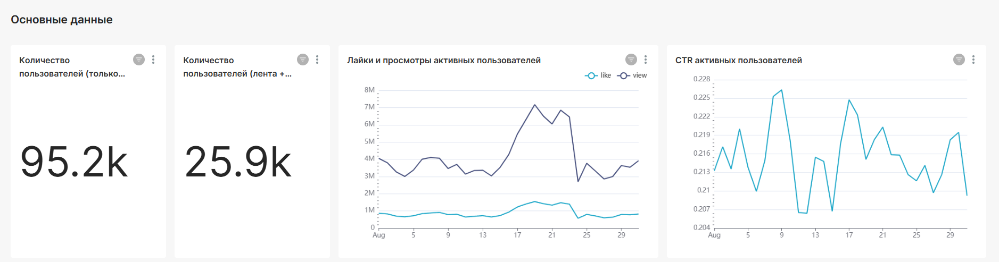

### "Анализ взаимодействия ленты новостей & сообщений приложения"   

**Стек:** Superset, ClickHouse, Pandahouse.  

**Описание задачи:**  
Составить дашборд, который описывает взаимодействие двух сервисов — ленты и сообщений.  

**Необходимо сделать:**  
1. выяснить какая у приложения активная аудитория по дням, т.е. пользователи, которые пользуются и лентой новостей, и сервисом сообщений;   
2. сколько пользователей использует только ленту новостей и не пользуются сообщениями;
3. исследовать связи двух продуктов;  
4. разработать дашборд с визуализацией результатов работы.

**Этапы работы:**
Подключение к БД, построение графиков с использованием новых полей, верстка дашборда.  

**Результат:**  
Создан дашборд в Superset, который отражает активность пользователей, которые смотрят ленту новостей и отправляют сообщения. 

